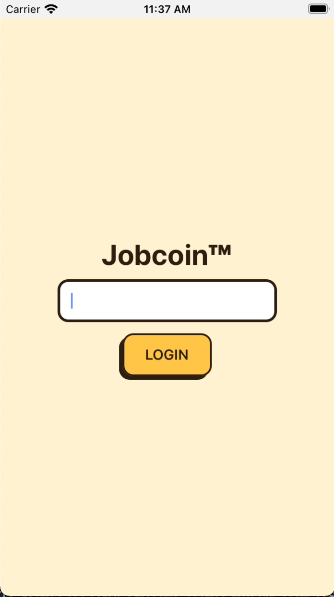
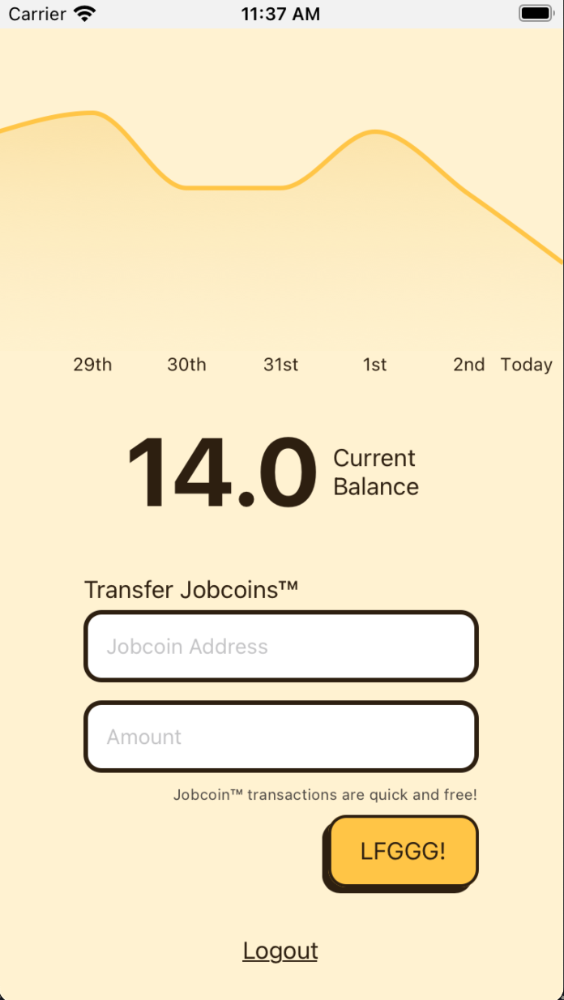

# Jobcoin™ Wallet

## Assignment

The Jobcoin™ wallet is meant to allow for easily log in, an intuitive account view, and easy transfer of Jobcoins™.

## App

## About the Project

It uses:

- React Native
- Typescript
- React Query
- Line Chart - @connectedcars/react-native-slide-charts
- Time/Dates - date-fns

### To Start

- `cd wallet`
- `npm i && npm start`
- I've been using xcode - open Xcode and open the workspace file in the `ios` folder
- That should be it 🎉

## Development Notes

My primary focus was to make an intuitive app that was aesthetically pleasing. I spent around 10 hours on this (way more than I was suppose to).

If I had more time I would focus on the following:

- Add more unit/integration/ui tests
- Add cool coin illustration
- I would custom create the line graph. I sunk a lot of time trying out different line charts. What I ended up using was _very_ close to the final effect that I was going for, but it's not quite right in the end. It's got a few issues that I found work arounds for.
  - I'd like it to snap to day rather than allow the user to drag across the full line (I've hidden the decimals for this reason).
  - I feel that it's overall a little unclear that the balance is grouped by days.
  - There are some issues when there is a single transaction (it's a flat line, I'd like to load up the graph with empty transactions)
  - I'd like to allow for changing the length of time that the graph shows. Right now it only shows the last 7 days, but I'd like to set it up to show week/month/yearly transactions
- I think I could have spent a little more time on error handling. To be honest I focused mostly on the "happy path."
- The app was created on an iOS simulator. I suspect that the 3d button look would not work on Android as I created it using a dropshadow method. If I spent more time on this I would figure out a way to achieve this effect without using shadows
- Right now we refetch the balance after a transaction occures. This works, but is probably not the most efficient. If I took more time I'd look into updating the local cache with the balance change
- Overall it could use more feedback. When you send coins I'd be great to add success feedback. If it fails better feedback would be appreciated by the user.
